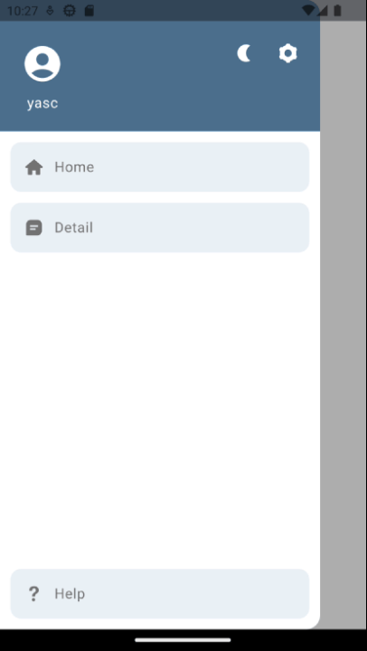

### Animated Theme Ripple Transition in Android Compose

Demonstrates a ripple-like theme transition in Android Compose, offering a visually appealing
switch between different themes.

#### In addition, the next simple examples are also inclided:
1. Full Navigation Drawer implementaiton in compose.
2. A more organized way to Read/Write app settings using the DataStore.
3. NavHost example.

### How the theme animation works:
1. When the transition is requested, a screenshot of the entire application is captured,
   before the theme change is applied.

2. The captured screenshot is overlaid on top of the UI.

3. While the screenshot is overlaid, the application theme gets changed.
   This happens without affecting the visual representation because of the screenshot overlay.

4. Then an animation starts where a clipping hole gets rendered in the screenshot to
   simulate a ripple effect. This clipping hole either shrinks or grows,
   depending on the selected theme, to reveal the newly applied theme beneath it.

5. The overlay screenshot is eventually removed, leaving the UI with the new theme visible.

### Demo:

